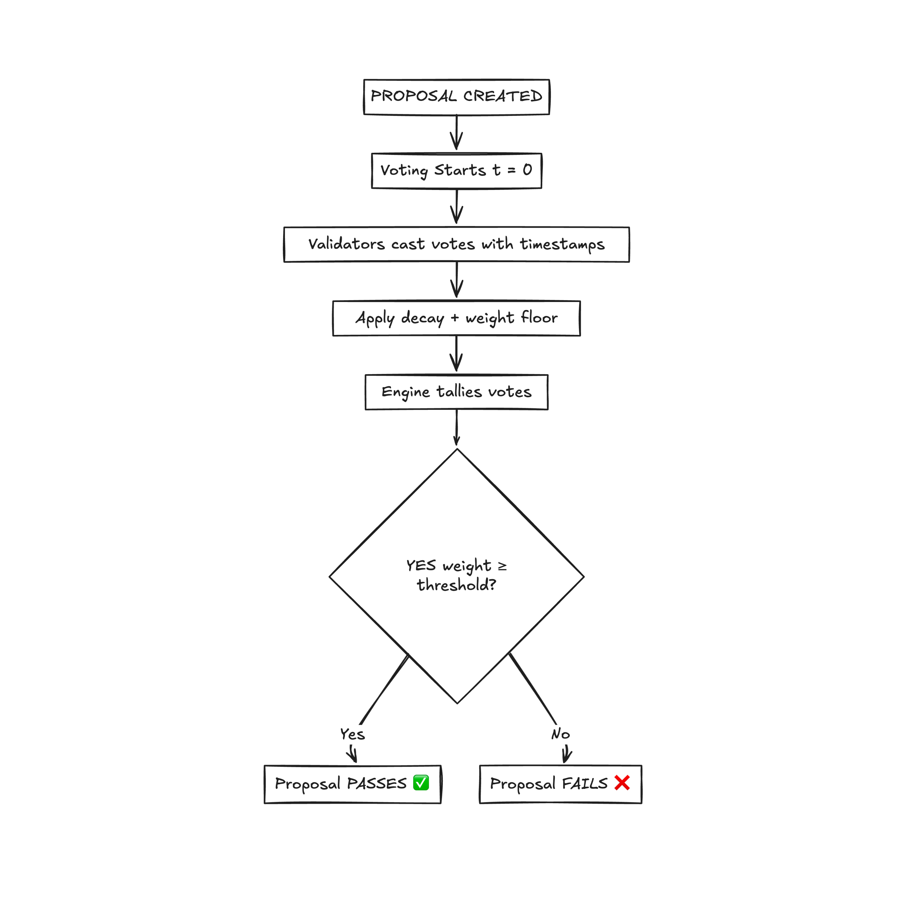

# 🗳️ Verdyce — Time-Decay Threshold Consensus Engine



Verdyce is a modular Rust-based system for decentralized voting and governance, built around time-decaying vote weights and escalating approval thresholds. It supports rich configuration, transparent auditing, and CLI interaction backed by Redis.

Ideal for validator governance, DAOs, or decentralized committees that need time-sensitive and fault-tolerant consensus.

---

## 🚀 What Makes Verdyce Unique?

### 🕓 Time-Decay Voting
- Vote weight decreases as time progresses
- Encourages early participation
- Multiple decay models:
  - **Linear** - Steady decline over time
  - **Exponential(rate)** - Rapid early decline
  - **Stepped** - Discrete phase-based weights

### 📈 Threshold Escalation
- Approval thresholds increase over time
- Supports multiple models:
  - **Linear(rate, start)** - Steady increase
  - **Exponential(rate, base)** - Rapid early increase
  - **Sigmoid(rate, floor)** - S-curve progression
- Ensures quick convergence early, higher scrutiny late

### 🪟 Smart Voting Windows
- Fixed duration + configurable grace period
- Auto-extension if:
  - Nearing threshold
  - Nearing time expiry
- Phases: Early, Mid, Late (used for future features)

### 🔧 CLI Tool with Redis
- Full proposal lifecycle management via CLI
- CLI state is stored in Redis for persistence and testability
- All actions (propose, vote, evaluate) are exposed via commands

---

## 🧱 Project Structure

```
verdyce/
├── verdyce-core/         # Consensus logic: votes, proposals, decay, etc.
│   ├── decay/            # Time-decay models
│   ├── threshold/        # Threshold progression functions
│   ├── window/           # Voting window state & timing
│   ├── models/           # Proposal + Vote structs & logic
│   ├── engine.rs         # Coordinator: evaluates & extends proposals
│   ├── lib.rs            # Core entrypoint for engine integration
│   └── tests/            # Unit tests for all modules
├── verdyce-cli/          # Command-line interface
│   ├── commands/         # `vote`, `new-proposal`, `evaluate`, etc.
│   ├── redis.rs          # Redis layer for state persistence
│   └── main.rs           # CLI entrypoint
├── verdyce-chain/        # Blockchain integration (future)
├── README.md             # You're reading it :)
└── Cargo.toml            # Workspace configuration
```

---

## 🔧 CLI Usage

All CLI commands use `verdyce` as the entrypoint binary.

### 🆕 Create a New Proposal

```bash
verdyce new-proposal \
  --title "Test Proposal" \
  --description "Description of what this proposal is for" \
  --duration 120
```

- `--duration` is in seconds
- Default decay/threshold models are currently pre-configured

### ✅ Cast a Vote

```bash
verdyce vote \
  --proposal-id <PROPOSAL_UUID> \
  --validator-id <VALIDATOR_UUID> \
  --choice yes
```

- `--choice` must be one of: `yes`, `no`, `abstain`

### 📊 Evaluate a Proposal

```bash
verdyce evaluate --id <PROPOSAL_UUID>
```

Manually evaluates the proposal:
- If `approval_ratio ≥ threshold`, mark as **Accepted**
- If expired without threshold, mark as **Rejected**

### ⏱️ Maybe Extend Voting

```bash
verdyce maybe-extend \
  --extension-seconds 30 \
  --threshold-proximity 0.9 \
  --time-proximity 0.8
```

If a proposal is close to threshold and near expiration, extend its voting window.

---

## 🧪 Running the Project

### Prerequisites
- **Rust** (stable toolchain)
- **Redis** (running locally or in Docker)

### 🧱 Build

```bash
cargo build --release
```

### ✅ Run All Tests

```bash
cargo test
```

### 🚀 Redis Setup

Start Redis locally:

```bash
redis-server
```

Or with Docker:

```bash
docker run -p 6379:6379 redis
```

Make sure the Redis instance is running on `localhost:6379`, or update the CLI's config to point to a different host/port.

---

## 📐 Architecture Summary

### Proposal Components
Each proposal contains:
- **Voting window** with state, duration, phase
- **Decay model** for vote weight calculation
- **Threshold model** for approval requirements
- **List of votes** (each with timestamp, validator, weight)

### Engine Responsibilities
The Engine:
- Adds proposals to the system
- Accepts & stores votes
- Evaluates votes against thresholds
- Extends windows intelligently if needed

### Vote Weight Calculation
| Model | Description | Behavior |
|-------|-------------|----------|
| Linear | Weight drops linearly from 1.0 → 0.1 | Steady decline |
| Exponential | Drops sharply early on | Front-loaded decay |
| Stepped | Discrete weight levels across phases | Phase-based weights |

### Threshold Progression
| Model | Formula | Notes |
|-------|---------|-------|
| Linear | `threshold = t * rate + start` | Steady increase |
| Exponential | `threshold = base + (1 - e^(-rate * t))` | Quick early rise |
| Sigmoid | S-curve progression | Smooth adaptive ramping |

---

## 🚀 Future Enhancements

- [ ] Web-based dashboard for proposal management
- [ ] Integration with blockchain networks (verdyce-chain)
- [ ] Advanced reputation scoring
- [ ] Multi-signature proposal creation
- [ ] Delegation and proxy voting
- [ ] Analytics and reporting features
- [ ] Configurable decay/threshold models via CLI

---

## 📄 License

This project is licensed under the MIT License - see the [LICENSE](LICENSE) file for details.

---

## 🤝 Contributing

Contributions are welcome! Please feel free to submit a Pull Request.

1. Fork the repository
2. Create your feature branch (`git checkout -b feature/AmazingFeature`)
3. Commit your changes (`git commit -m 'Add some AmazingFeature'`)
4. Push to the branch (`git push origin feature/AmazingFeature`)
5. Open a Pull Request