# 🗳️ Verdyce Core — Time-Decay Threshold Consensus Engine

A modular Rust library for decentralized voting and governance, built around time-decaying vote weights and escalating approval thresholds. Designed for validator governance, DAOs, and decentralized committees that need time-sensitive and fault-tolerant consensus.

## 🏗️ Architecture

```mermaid
flowchart TD
  A[PROPOSAL CREATED] --> B[Voting Starts t = 0]
  B --> C[Validators cast votes with timestamps]
  C --> D[Apply decay + weight floor]
  D --> E[Engine tallies votes]
  E --> F{YES weight ≥ threshold?}
  F -- Yes --> G[Proposal PASSES ✅]
  F -- No --> H[Proposal FAILS ❌]
```



## 🚀 Core Features

### 🕓 Time-Decay Voting
Vote weights decrease over time to encourage early participation:
- **Linear**: Steady decline from 1.0 to 0.1
- **Exponential**: Rapid early decline with configurable rate
- **Stepped**: Discrete weight levels (1.0 → 0.5 → 0.1)

### 📈 Dynamic Thresholds
Approval thresholds increase over time for higher scrutiny:
- **Linear**: `threshold = t × rate + start`
- **Exponential**: Asymptotic growth with configurable parameters
- **Sigmoid**: S-curve progression for smooth transitions

### 🪟 Smart Voting Windows
- Configurable duration with grace periods
- Auto-extension when near threshold and time expiry
- State tracking: NotStarted → Open → Extended → GracePeriod → Expired

### ⚖️ Revision Penalties
Vote changes are penalized to discourage manipulation:
- Weight penalty: `base_weight / (1 + revisions)²`
- Minimum weight floor of 0.1 ensures all votes count

---

## 🧱 Project Structure

```
src/
├── lib.rs              # Library entry point
├── engine.rs           # Main consensus coordinator
├── models/             # Core data structures
│   ├── proposal.rs     # Proposal logic and evaluation
│   └── vote.rs         # Vote structures and weight calculation
├── decay/              # Time-decay models
├── threshold/          # Threshold progression models
└── window/             # Voting window management
```

---

## 🚀 Quick Start

Add to your `Cargo.toml`:

```toml
[dependencies]
verdyce-core = "0.1.0"
```

### Basic Usage

```rust
use verdyce_core::{
    engine::Engine,
    models::{proposal::Proposal, vote::{Vote, VoteChoice}},
    decay::DecayModel,
    threshold::ThresholdModel,
};
use uuid::Uuid;
use chrono::Utc;

// Create consensus engine
let mut engine = Engine::new();

// Create a proposal with 1-hour voting period
let proposal = Proposal::new(
    "Upgrade Protocol".to_string(),
    "Proposal to upgrade the protocol to v2.0".to_string(),
    3600, // 1 hour in seconds
    DecayModel::Linear,
    ThresholdModel::Linear(0.0001, 0.5), // Start at 50%, increase slowly
);

let proposal_id = proposal.id;
engine.add_proposal(proposal);

// Cast a vote
let vote = Vote {
    validator_id: Uuid::new_v4(),
    choice: VoteChoice::Yes,
    timestamp: Utc::now(),
    revision: 0,
    reason: Some("Looks good to me".to_string()),
};

engine.cast_vote(proposal_id, vote);

// Evaluate all proposals
engine.evaluate_all(Utc::now());

// Check results
if let Some(proposal) = engine.get_proposal(proposal_id) {
    println!("Proposal status: {:?}", proposal.status);
    println!("Approval ratio: {:.2}", proposal.current_approval_ratio());
}
```

### Advanced Configuration

```rust
use verdyce_core::{decay::DecayModel, threshold::ThresholdModel};

// Exponential decay (rapid early decline)
let decay = DecayModel::Exponential(0.001);

// Sigmoid threshold (S-curve progression)
let threshold = ThresholdModel::Sigmoid(10.0, 0.4);

let proposal = Proposal::new(
    "Critical Update".to_string(),
    "Emergency protocol fix".to_string(),
    1800, // 30 minutes
    decay,
    threshold,
);
```

---

## 🧪 Development

### Prerequisites
- Rust (stable toolchain)

### Build & Test

```bash
# Build the library
cargo build

# Run all tests
cargo test

# Run with documentation tests
cargo test --doc

# Check code quality
cargo clippy

# Generate documentation
cargo doc --open
```

### Running Examples

```bash
# Run integration tests
cargo test --test '*'

# Run specific test module
cargo test --test vote_test
```

---

## 📊 Model Comparison

### Decay Models
| Model | Early Weight | Mid Weight | Late Weight | Use Case |
|-------|-------------|------------|-------------|----------|
| Linear | 1.0 | 0.5 | 0.1 | Steady participation incentive |
| Exponential | 1.0 | ~0.4 | 0.1 | Strong early participation bias |
| Stepped | 1.0 | 0.5 | 0.1 | Clear phase-based incentives |

### Threshold Models
| Model | Early Threshold | Mid Threshold | Late Threshold | Behavior |
|-------|----------------|---------------|----------------|----------|
| Linear | Configurable | Steady increase | High | Predictable progression |
| Exponential | Low | Rapid increase | Asymptotic | Quick early decisions |
| Sigmoid | Low | Smooth transition | High | Balanced progression |

---

## 🤝 Contributing

Contributions are welcome! Please ensure:

1. All tests pass: `cargo test`
2. Code is properly formatted: `cargo fmt`
3. No clippy warnings: `cargo clippy`
4. Documentation is updated for public APIs

### Development Workflow

1. Fork the repository
2. Create a feature branch: `git checkout -b feature/amazing-feature`
3. Make your changes with tests
4. Ensure all checks pass
5. Submit a pull request

---

## 📄 License

This project is licensed under the MIT License - see the LICENSE file for details.